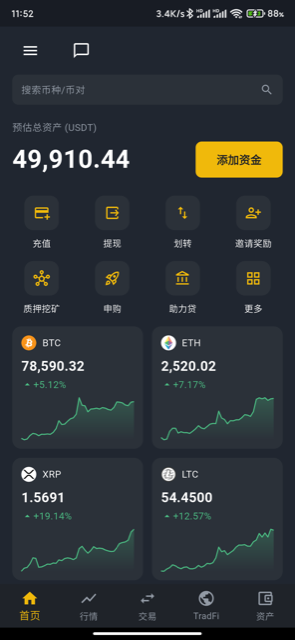
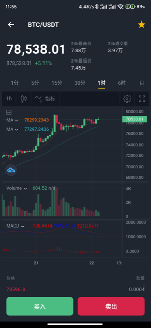
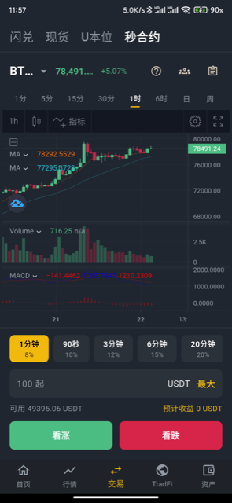
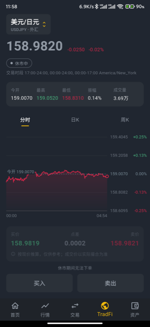
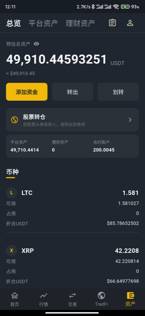

# CoinExchange · RWA-BTX

**数字资产交易所系统** —— 现货、合约、秒合约、理财、跟单、传统金融（外汇 / 美股 / 指数）一体化，四端 + 原生双端 App 齐备，开箱即可运营

 

&nbsp;

&nbsp;

**👉 文档站：<https://bizzancoin.github.io/CoinExchange/>**

---

> [!NOTE]
> 本仓库托管的是 **RWA-BTX 产品与使用文档站**（编译后的静态页面），产品介绍、功能清单、运营指南、常见问题、更新日志都在文档站里，**请直接访问 <https://bizzancoin.github.io/CoinExchange/zh/> 阅读**。
>
> 完整源码（撮合引擎、管理后台、PC / H5、原生双端 App、自建节点）随「源码版 / FDE 版」交付，详见文档站的[价格套餐](https://bizzancoin.github.io/CoinExchange/zh/intro/pricing)。

## ✨ 能做什么

| 模块 | 说明 |
| --- | --- |
| 🪙 现货 / 闪兑 | 币币交易（限价、市价），两种资产按当前价格直接兑换 |
| ⏱️ 秒合约 | 短周期涨跌判断，到期按结果结算 |
| 📈 U 本位永续合约 | 带杠杆的多空双向交易，支持止盈止损与强制平仓 |
| 🌐 TradFi 传统金融 | 外汇、商品、股票、指数、港股等标的的行情与交易 |
| 👥 跟单交易 | 带单员发码，用户凭码一键跟投 |
| 💰 理财与增值 | 理财、质押挖矿、申购（打新）、自发币与做市 |
| ⚙️ 运营配置 | 底部菜单、热门币种、首页快捷入口、VIP 等级、功能开关等后台一改即生效，无需发版 |
| 📱 四端 + 原生 App | 管理后台、做市商端、PC 站、H5 站，另有原生双端 App（Android / iOS），支持自动检测更新 |
| 🌍 多语言 | 用户端支持简中、繁中、英、日、韩、越、泰 7 种语言 |
| 👛 BTX Wallet（内测中） | 自托管 Web3 钱包，用 USDC / USDT 在链上买卖 xStocks 代币化美股与 ETF |

完整功能清单 👉 [能力总览](https://bizzancoin.github.io/CoinExchange/zh/intro/features)

## 📱 App 截图

<table>
  <tr>
    <td align="center"> 首页</td>
    <td align="center"> K 线行情</td>
    <td align="center"> 秒合约</td>
    <td align="center"> TradFi 传统金融</td>
    <td align="center"> 资产</td>
  </tr>
</table>

更多介绍 👉 [移动端 App](https://bizzancoin.github.io/CoinExchange/zh/app/overview) ｜ [BTX Wallet](https://bizzancoin.github.io/CoinExchange/zh/app/wallet)

## 📚 文档直达

| 想了解 | 链接 |
| --- | --- |
| 这是什么系统 | [产品介绍](https://bizzancoin.github.io/CoinExchange/zh/intro/what-is) |
| 有哪些功能 | [能力总览](https://bizzancoin.github.io/CoinExchange/zh/intro/features) |
| 怎么收费 | [价格套餐](https://bizzancoin.github.io/CoinExchange/zh/intro/pricing) |
| 后台怎么用 | [运营使用指南](https://bizzancoin.github.io/CoinExchange/zh/guide/admin-login) |
| 遇到问题 | [常见问题](https://bizzancoin.github.io/CoinExchange/zh/faq/) |
| 最近更新了什么 | [更新日志](https://bizzancoin.github.io/CoinExchange/zh/changelog/) |

## 💬 联系我们

- 📢 **Telegram 频道**：<https://t.me/bnbcode_channel> —— 产品更新动态第一时间获取，欢迎关注
- 🤖 **申请测试站**：Telegram 机器人 [@BNBCODE_BOT](https://t.me/BNBCODE_BOT)，发送「申请测试站」即可获取测试地址与专属体验账号
- 🧑‍💼 **人工客服**：[@usdtvps666](https://t.me/usdtvps666) —— 套餐咨询、报价、技术支持
- 🌐 **官网**：<https://www.bnbcode.com>

> [!WARNING]
> 本系统仅供在中国大陆以外地区合法合规运营，**严禁在中国大陆境内运营**。购买前请阅读[免责声明](https://bizzancoin.github.io/CoinExchange/zh/legal/disclaimer)。

**关键词**：BTC 交易所 ｜ ETH 交易所 ｜ 数字货币合约交易所 ｜ 秒合约 ｜ 永续合约 ｜ 代币化美股（xStocks）｜ 外汇 / 指数 / 期货交易平台 ｜ 撮合交易引擎 ｜ 原生双端 App ｜ Java + Vue

---

## English

**RWA-BTX** is a digital asset exchange system: spot, instant swap, binary options (seconds contracts), USDT-margined perpetuals, wealth products, copy trading and traditional markets (forex, commodities, stocks, indices, HK equities) in one system — admin console, market maker portal, PC and H5 sites, plus a native dual-platform app (Android / iOS).

This repository hosts the **compiled product & user documentation site**. Please read it at **<https://bizzancoin.github.io/CoinExchange/>**.

- [Product Overview](https://bizzancoin.github.io/CoinExchange/intro/what-is) · [Features](https://bizzancoin.github.io/CoinExchange/intro/features) · [Pricing](https://bizzancoin.github.io/CoinExchange/intro/pricing) · [Operator Guide](https://bizzancoin.github.io/CoinExchange/guide/admin-login) · [FAQ](https://bizzancoin.github.io/CoinExchange/faq/) · [Changelog](https://bizzancoin.github.io/CoinExchange/changelog/)
- 📢 Product updates: Telegram channel <https://t.me/bnbcode_channel>
- 🤖 Request a demo: [@BNBCODE_BOT](https://t.me/BNBCODE_BOT) · 🧑‍💼 Support: [@usdtvps666](https://t.me/usdtvps666) · 🌐 <https://www.bnbcode.com>

> [!WARNING]
> This system is intended solely for lawful, compliant operation outside mainland China. **Operating it within mainland China is strictly prohibited.** See the [Disclaimer](https://bizzancoin.github.io/CoinExchange/legal/disclaimer).
